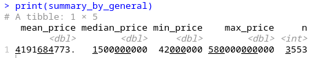
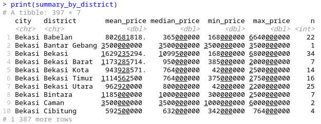
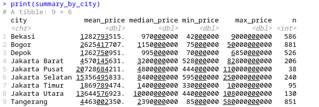
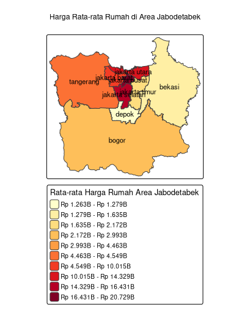

# Housing Price Analysis and Visualization in Jabodetabek

## Description  
This project aims to analyze and visualize housing prices in the Greater Jakarta area (Jabodetabek) using a dataset from [Kaggle](https://www.kaggle.com/datasets/nafisbarizki/daftar-harga-rumah-jabodetabek). The original dataset contains basic information such as listing titles and prices, but lacks detailed geographic information. Therefore, a parsing process was carried out to extract location data to support statistical and spatial analysis.

---

## Data Source  
- Dataset: [Housing Prices in Jabodetabek - Kaggle](https://www.kaggle.com/datasets/nafisbarizki/daftar-harga-rumah-jabodetabek)

---

## Dataset Structure  
Main columns in the dataset:  
- `url`: Link to the property listing  
- `price_in_rp`: Property price in Indonesian Rupiah  
- `title`: Title of the listing containing descriptive property information  

---

## Problem  
The dataset does not provide detailed location columns (such as district or city), which limits geographic-based analysis.

---

## Solution: Title Parsing  
Using the R programming language, the `title` column was parsed to extract relevant location information such as:  
- `district` (subdistrict)  
- `city`  

Additional columns such as number of floors, land area, house type, condition, toll/station access, and other features were also extracted, although the focus of the analysis is on the `district` and `city`.

---

## Statistical Output  
Two summary datasets were generated for analysis:  
- `summary_by_district`: Aggregated housing price statistics by district  
- `summary_by_city`: Aggregated housing price statistics by city  

---

## Visualization  
Visualization was created using the `tmap` package in R and shapefiles obtained via the `geodata` package. Cities and their corresponding regencies (e.g., Bogor City and Bogor Regency) were grouped together to eliminate internal borders, providing a clearer spatial representation of average housing prices.

---

## Usage  
1. Download the dataset from Kaggle.  
2. Run the parsing script in R to extract location data from the `title` column.  
3. Use the resulting `summary_by_city` and `summary_by_district` for analysis.  
4. Visualize the data using `tmap` with administrative shapefiles, merging regions to remove internal borders.

---

## Dependencies  
- R (latest version)  
- R packages: `dplyr`, `stringr`, `sf`, `tmap`, `geodata`, `scales`

---

## Contact  
Achmed Hibatillah  
GitHub: [@achmedhibatillah](https://github.com/achmedhibatillah)  
Email: contact@achmedhibatillah.com  
